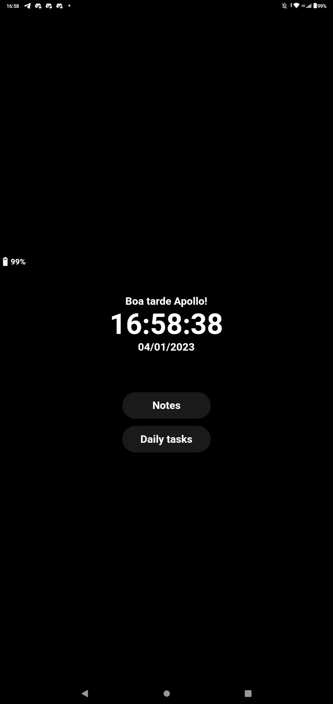
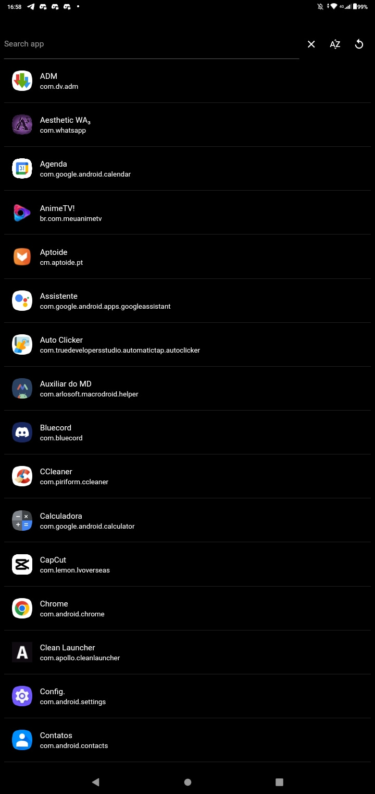

# Clean Launcher
Um simples launcher para android, leve e direto ao ponto. Feito para pessoas com foco em produtividade e que não querem gastar tempo com informações indesejadas.

## Funcionalidades

- Mostra os aplicativos em tempo real
- Tem um bloco de notas imbutido.
- Faz gerenciamento de rotina.
- Leve, e tem um visual clean.

## Paleta de cores

| Cor               | Hexadecimal                                                |
| ----------------- | ---------------------------------------------------------------- |
| Cor de background     |  '#000000' |
| Cor de primaria (textos, butões, etc) |  '#FFFFFF'|

## Screenshots
#### Página inicial do app

#### Página de applicativos

## Instalação

Baixe o Clean Launcher por meio da área de [release](https://github.com/MrZethaz/cleanlauncher/releases) do projeto de acordo com sua arquitetura;
Atualmente o app está compilado para as seguintes arquiteturas do android:
- Arm
- Arm64
- x64

Assim que baixado:
- Instale o apk normalmente da pasta que você escolheu para baixa-lo 📁
- Vá nas configurações do seu dispositivo e procure a opção de app de ínicio padrão. 📱
- Mude para Clean Launcher. ⚡
- Aproveite o app 😋

## Algumas informações
#### Autor
[@MrZethaz](https://github.com/MrZethaz)

#### Etiquetas

#### Licença

[MIT](https://choosealicense.com/licenses/mit/)

## Feedback

Se você tiver algum feedback, por favor me deixe saber por meio de mrzetha@protonmail.ch 😉
